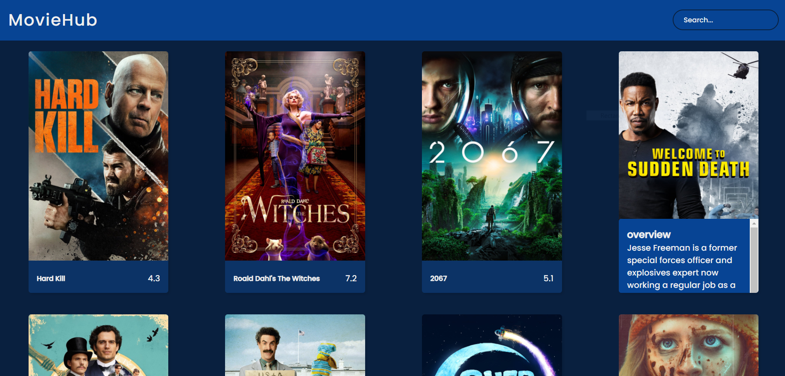

# Deprecated (Not actively maintained, but you can still use.)

## How to use

- You have to search [The Movie DB](https://www.themoviedb.org/) and create your account.

- Then you have navigate to your profile and go to the settings tab.

- Go to the API link on the left side bar.

- Then fill the form and request the API key.

- Replace the API_KEY attribute with your API key in the API stuff section and use those sitations in the source code.

## API stuff:

Featured : "https://api.themoviedb.org/3/discover/movie?sort_by=popularity.desc&api_key={API_key}&page=1"

Images : "https://image.tmdb.org/t/p/w1280/"

Search : "https://api.themoviedb.org/3/search/movie?&api_key={API_key}&query="

- (You can create a `.env` file and paste the API key as `REACT_APP_API_KEY = API_KEY` for the security. And use it wherever you want using `process.env.REACT_APP_API_KEY` snippet.)

## Available Scripts

In the project directory, you can run:

## `npm start`

Runs the app in the development mode.\
Open [http://localhost:3000](http://localhost:3000) to view it in the browser.

The page will reload if you make edits.\
You will also see any lint errors in the console.
